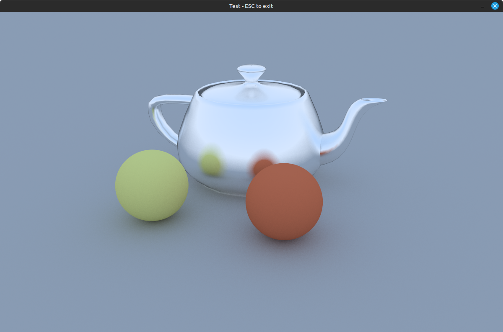
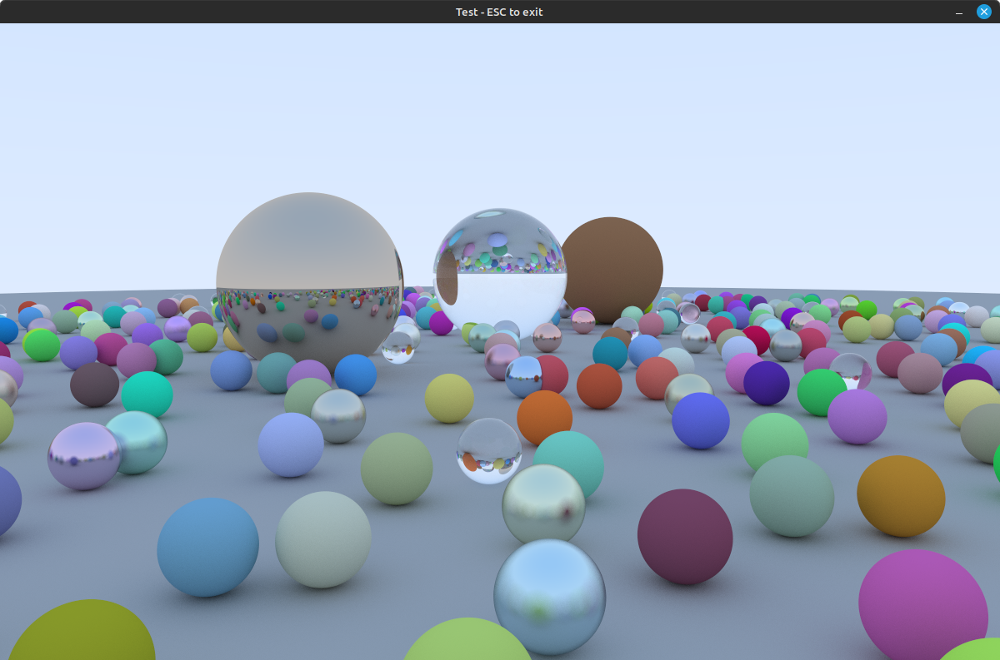
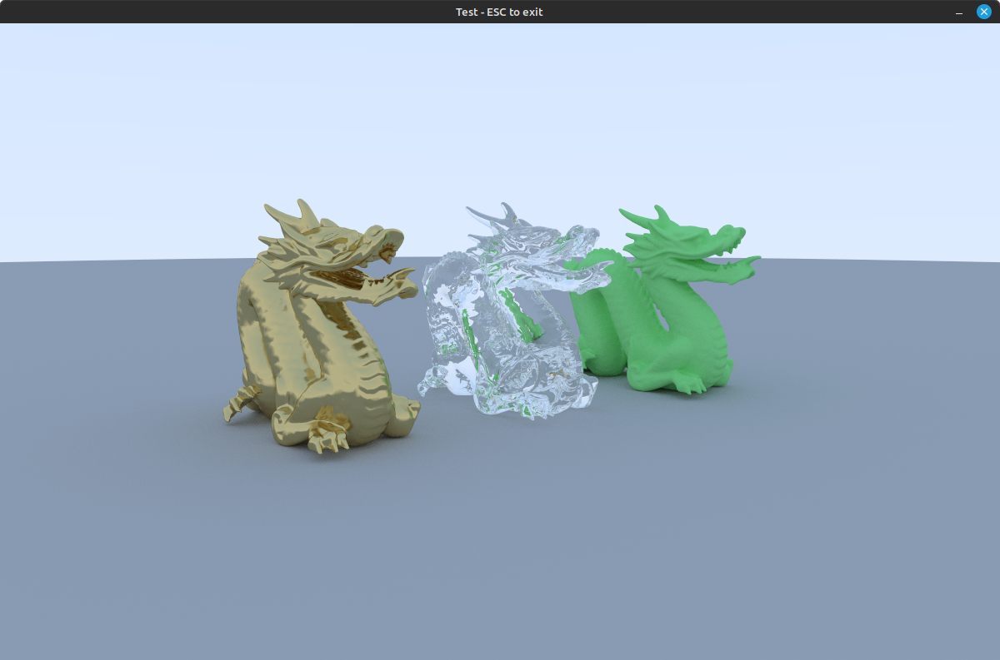

ZTracer - toy ray tracer, made to learn Rust and ray tracing

- data oriented design
- BVH
- parallel rendering using Rayon

Features:
- triangles and spheres
- sky boxes
- Materials:

Example renderings:

Resources:
- Ray Tracing in One Weekend
- PBRT
